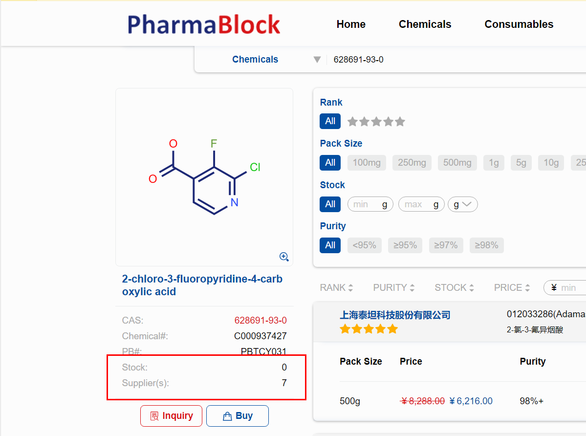

# 4.其他功能

**4.1检索化学品时，除了可以看到产品的基本信息外，还可以看到库存信息和提供此产品的供应商数目**

 **4.2购买化学品金额超过研发员权限、购买化学品有库存等情况，需说明购买原因，上级领导审批。领导可以进入My Review进行审批。**
 

审批同意，单据会到Approved列表里，显示审核通过，订单会发送到相应的供应商那里或到采购这边处理

审批拒绝，单据会到Rejected列表里，显示审核不通过和拒绝的原因，单据会返回到相应的研发员那里

**4.3平台购买EHS管制品，会将购买申请以邮件的形式转交EHS，EHS会和相应的研发人员联系确认，由EHS购买。**

**4.4如果您要购买的化学品，近期购买或者询价过，将在您检索的第一行显示有REC BUY标记的信息，表示近期的购买或者询价记录（包括供应商名称、数量、价格），供您参考，如果您想购买此供应商的这个产品，分为两种情况：
   第一种情况，该供应商在采购平台上，购买流程同常规购买流程，点击下面方框里的购买即可，界面如下**

第二种情况，该供应商没有在采购平台上，可以点击购买或询价记录那行进行购买，但只可以购买其数量的整数倍（1、2、3倍等）；如若想购买的量不是其整数倍或者比其数量少，可以联系采购员：王小明。

**4.5如果刚购买的化学品，突然发现不需要了，可根据订单的不同状态，做相应的取消动作。订单在In Process、Purchasing状态，可直接取消；若订单已在Order Placed状态，平台点击取消的同时，还需要通知采购员：王小明 取消（注：Order Placed 表示已经和供应商签署采购合同，无法保证一定能取消成功，请研发同事有使用需要再购买，谢谢）**

**4.6购买化学品后，订单已完成，大家及时对相应订单进行评价，以便我们对供应商的管理，后面给大家带来更好的购买体验，谢谢大家。**
